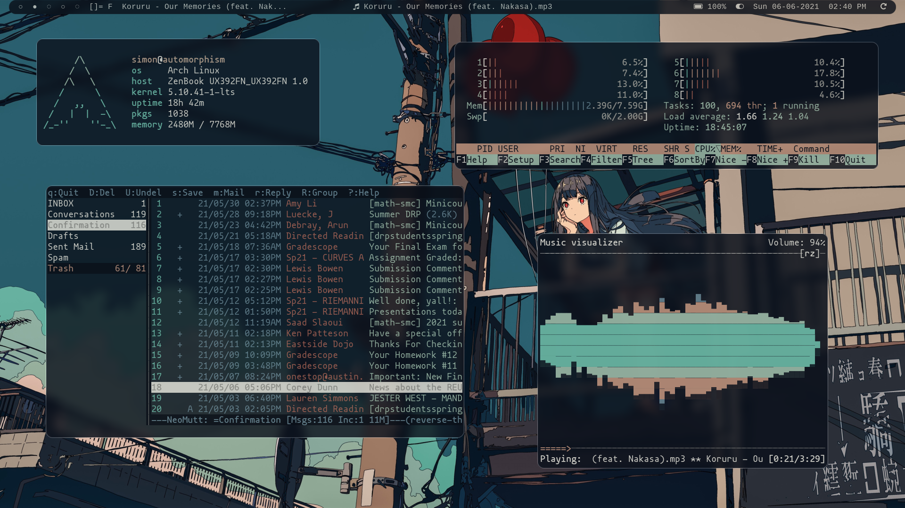
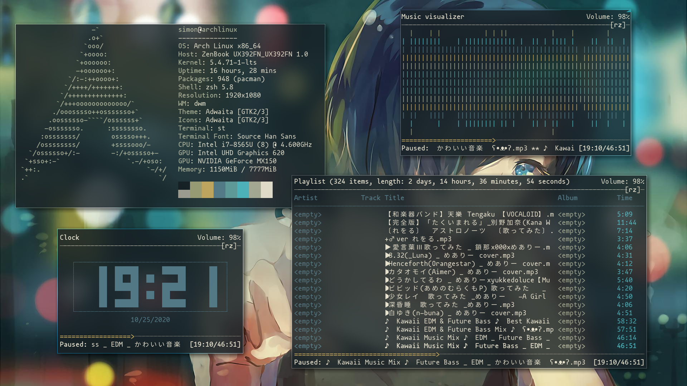
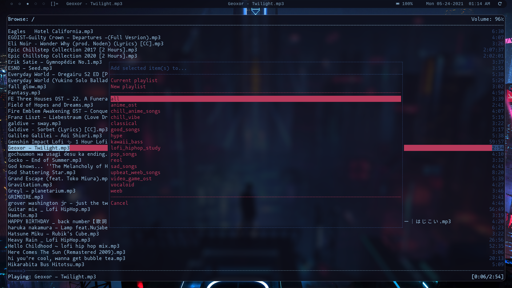
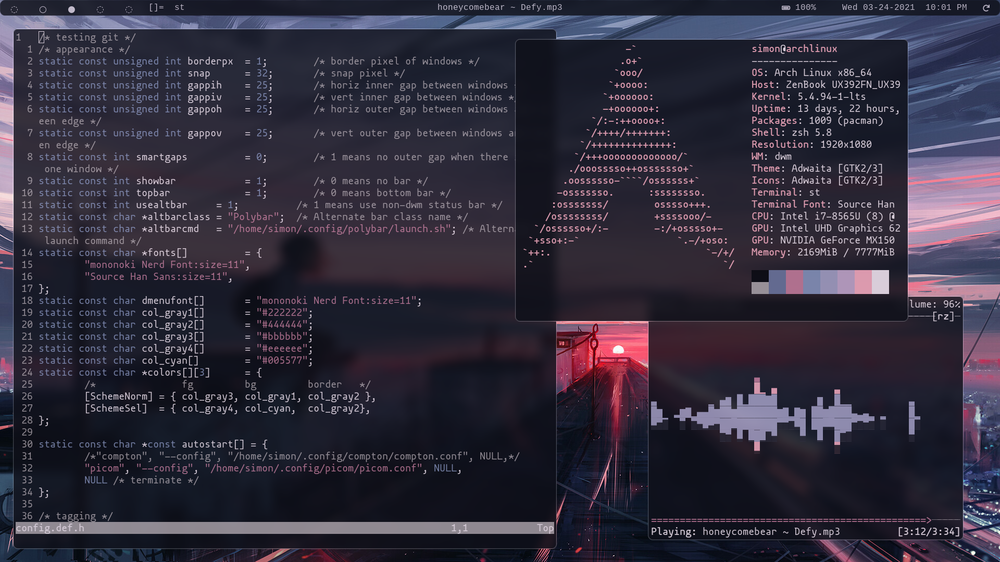
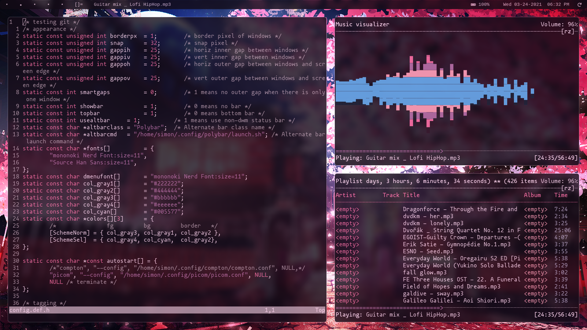
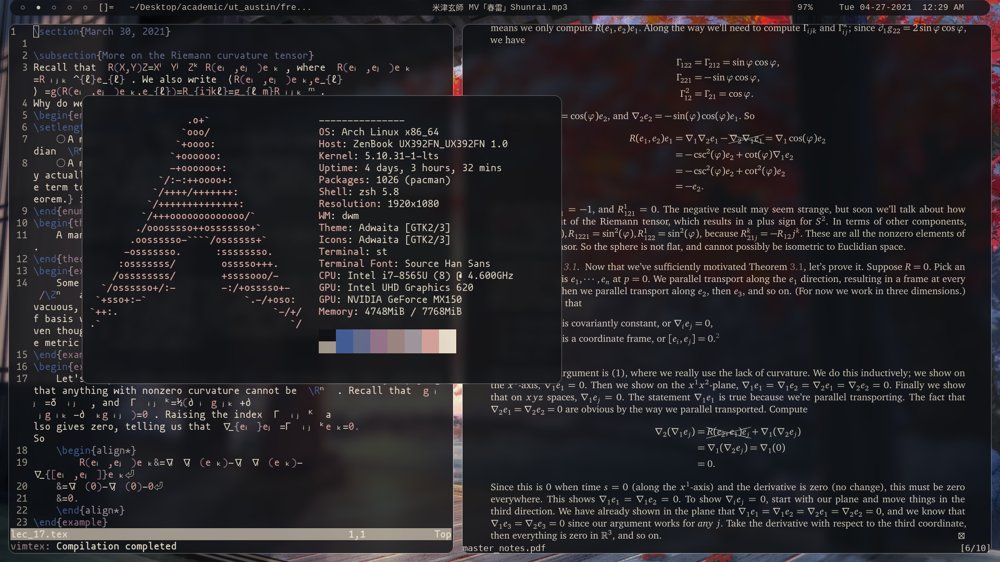
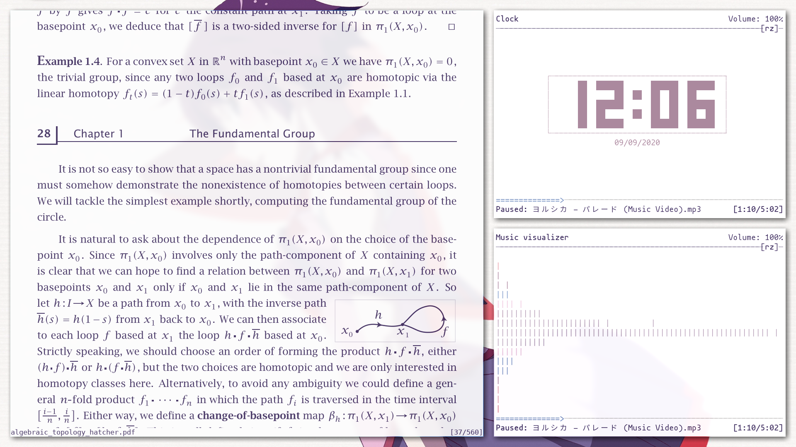

# Dotfiles
Welcome to my setup! Details below.

## Setup
- OS: Arch Linux
- Shell: zsh
- Window Manager: dwm
- Terminal emulator: st
- Bar: polybar
- Editor: neovim
- Font: mononoki
- Color scheme: pywal
- Music player: ncmpcpp+mpd
- Email: neomutt
- Video player: mpv
- Image viewer: sxiv
- File browser: vifm+ueberzug
- Wallpaper: xwallpaper
- RSS reader: newsboat
- Compositor: picom
- PDF Viewer: zathura

### More information
- Scripts I've written (mostly git stuff) are in `~/.local/bin`
- There are separate repositories for my [dwm](https://github.com/simonxiang1/dwm) and [st](https://github.com/simonxiang1/st) setups

